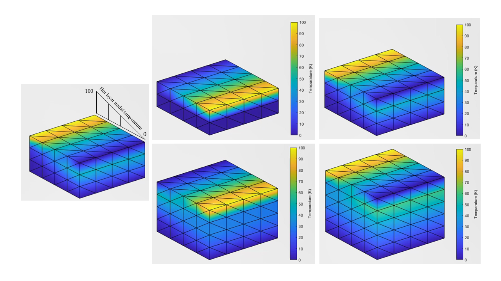

Heat equation numerical solution for PDE in 3D media applied to additive manufacuring where different layers are deposited by 3D printers

  

https://github.com/ashkspark/thermal_additive_Layer-by_Layer/assets/59840979/0f6f727b-764b-4d5d-9335-d5650a99579d

